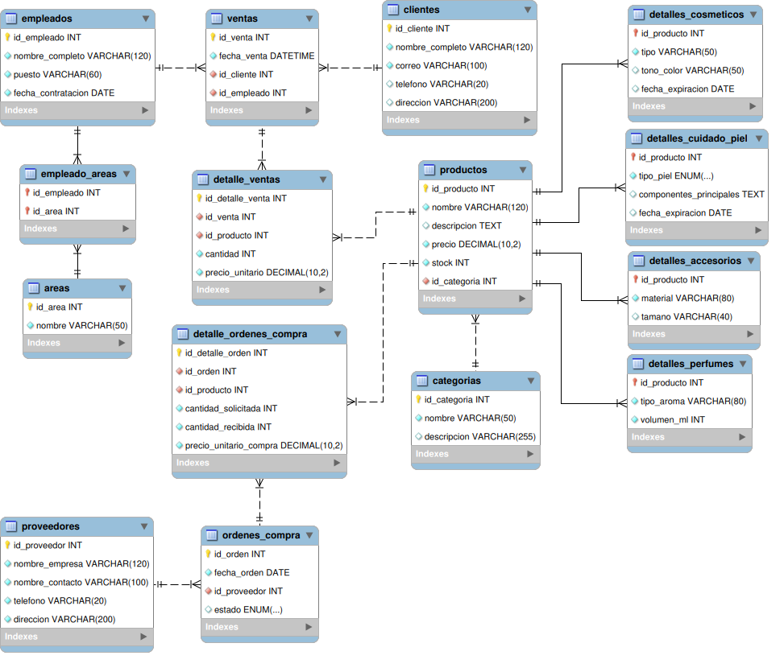

# Base de Datos: Tienda de Maquillaje

Este repositorio contiene el diseño, modelado relacional, definición de estructura (DDL), inserción de datos de prueba (DML), desarrollo de funciones y procedimientos almacenados, y ejecución de consultas analíticas (DQL) para la base de datos `tienda_maquillaje_db`.

## Diagrama Entidad-Relación (ER)

<p align="center">
  
</p>

## Archivos del Proyecto

| Archivo | Tipo / Formato | Descripción |
| :--- | :--- | :--- |
| [`estructura.sql`](./estructura.sql) | **Script SQL (DDL)** | Archivo de definición de datos (*Data Definition Language*). Contiene la creación de la base de datos `tienda_maquillaje_db`, las tablas normalizadas, definición de llaves primarias (`PRIMARY KEY`), llaves foráneas (`FOREIGN KEY`), restricciones de unicidad (`UNIQUE`), tipos `ENUM` y valores por defecto (`DEFAULT`). |
| [`datos.sql`](./datos.sql) | **Script SQL (DML)** | Archivo de manipulación de datos (*Data Manipulation Language*). Contiene las inserciones de datos de prueba coherentes para áreas, empleados, categorías, productos, detalles por categoría, clientes, ventas y órdenes de compra. |
| [`funciones_procedimientos.sql`](./funciones_procedimientos.sql) | **Script SQL (DQL)** | Archivo de lógica de negocio almacenada. Contiene la creación de 8 procedimientos almacenados y 2 funciones escalares requeridas para resolver de forma modular cada una de las consultas del taller. |
| [`consultas.sql`](./consultas.sql) | **Script SQL (DQL)** | Archivo de ejecución y pruebas. Contiene las llamadas (`CALL`) e invocaciones (`SELECT`) de todas las rutinas almacenadas para validar los requerimientos sobre los datos de prueba. |
| [`Diagrama.mwb`](./Diagrama.mwb) | **Modelo MySQL Workbench** | Archivo fuente editable del modelo relacional físico en MySQL Workbench (*MySQL Workbench Model*). |
| [`diagrama-er.png`](./diagrama-er.png) | **Imagen PNG** | Exportación visual del diagrama entidad-relación generado desde el modelo físico. |
| [`README.md`](./README.md) | **Markdown** | Documentación integral del proyecto, estructura de tablas, relaciones, orden de ejecución y detalle de las consultas. |

## Orden de Ejecución de los Scripts SQL

Para desplegar y consultar correctamente la base de datos sin errores de dependencias ni llaves foráneas, los scripts deben ejecutarse estrictamente en el siguiente orden:

```
Paso 1: estructura.sql
  │     (Crea la base de datos, tablas y restricciones)
  ▼
Paso 2: datos.sql
  │     (Inserta los registros de prueba)
  ▼
Paso 3: funciones_procedimientos.sql
  │     (Compila las funciones y procedimientos almacenados)
  ▼
Paso 4: consultas.sql
        (Ejecuta las consultas y pruebas del taller)
```

1. **`1. estructura.sql` (DDL)**:
   * Elimina la base previa si existe y crea `tienda_maquillaje_db`.
   * Construye las tablas de catálogos, empleados, especialización de productos, ventas y órdenes de compra con sus restricciones de integridad referencial.
2. **`2. datos.sql` (DML)**:
   * Inserta los datos respetando la jerarquía relacional (áreas, empleados, asignaciones, categorías, productos, subtablas de especialización, clientes, ventas y órdenes de compra).
3. **`3. funciones_procedimientos.sql` (DQL)**:
   * Define y compila en el servidor los 8 procedimientos almacenados y las 2 funciones con delimitadores de bloque (`DELIMITER //`).
4. **`4. consultas.sql` (DQL)**:
   * Ejecuta las llamadas a las rutinas almacenadas comprobando los resultados esperados de cada ejercicio.

> **Ejecución desde terminal (MySQL CLI):**
> ```bash
> mysql -u usuario -p < estructura.sql
> mysql -u usuario -p < datos.sql
> mysql -u usuario -p < funciones_procedimientos.sql
> mysql -u usuario -p < consultas.sql
> ```

## Proceso de Desarrollo del Proyecto

El desarrollo de la base de datos se ejecutó siguiendo un flujo metodológico estructurado en 4 fases:

### Fase 1: Diseño y Modelado Relacional (ERM)
1. **Identificación de entidades**: Se identificaron los módulos del negocio: empleados, áreas de trabajo, catálogo de productos y categorías, clientes, ventas y proveedores.
2. **Organización de tablas**:
   * Se creó la tabla `empleado_areas` para que un empleado pueda pertenecer a varias áreas al mismo tiempo.
   * Se crearon tablas separadas para los detalles de cada categoría (cosméticos, cuidado de la piel, perfumes y accesorios) para evitar dejar columnas vacías en la tabla general de productos.
   * Se crearon tablas de detalle (`detalle_ventas` y `detalle_ordenes_compra`) para registrar múltiples productos por cada compra o pedido.
3. **Modelado visual**: Construcción del esquema en **MySQL Workbench**, definiendo las tablas, sus columnas y relaciones.

### Fase 2: Implementación de la Estructura (DDL)
* Creación del script [`estructura.sql`](./estructura.sql) con las sentencias de definición de esquema.
* Definición de llaves primarias autoincrementales (`AUTO_INCREMENT`) y llaves primarias compuestas en tablas intermedias.
* Declaración de llaves foráneas directas (`FOREIGN KEY`) para preservar la integridad referencial.
* Aplicación de restricciones de unicidad (`UNIQUE`), valores por defecto (`DEFAULT CURRENT_TIMESTAMP`) y tipos enumerados (`ENUM`).

### Fase 3: Carga y Poblado de Datos (DML)
* Creación del script [`datos.sql`](./datos.sql) para cargar datos de prueba consistentes y calibrados a la fecha actual del sistema.
* Carga de 3 áreas, 5 empleados, 4 categorías de productos, 15 productos con sus correspondientes registros de especialización, 5 clientes, 8 ventas con sus detalles, 3 proveedores y 5 órdenes de compra.

### Fase 4: Programación Almacenada y Consultas (DQL)
* Creación del script [`funciones_procedimientos.sql`](./funciones_procedimientos.sql) con la lógica para cada consulta:
  * Uso de **Procedimientos Almacenados** para devolver conjuntos tabulares de resultados (filas y columnas).
  * Uso de **Funciones Almacenadas** para retornar valores escalares calculados (montos y conteos).
* Creación del script [`consultas.sql`](./consultas.sql) con las sentencias de prueba de cada rutina.

## Claves Primarias (PK) y Claves Foráneas (FK)

A continuación se detalla la definición de claves primarias y foráneas por cada tabla del modelo:

| Tabla | Clave Primaria (PK) | Clave Foránea (FK) | Tabla y Campo Referenciado | Propósito / Descripción |
| :--- | :--- | :--- | :--- | :--- |
| **`areas`** | `id_area` | *Ninguna* | - | Identificador único del área de trabajo. |
| **`empleados`** | `id_empleado` | *Ninguna* | - | Identificador único del empleado. |
| **`empleado_areas`** | `(id_empleado, id_area)` | `id_empleado`<br>`id_area` | `empleados(id_empleado)`<br>`areas(id_area)` | Llave primaria compuesta para la asignación N:M de empleados a áreas. |
| **`categorias`** | `id_categoria` | *Ninguna* | - | Identificador de la categoría de producto. |
| **`productos`** | `id_producto` | `id_categoria` | `categorias(id_categoria)` | Identificador del producto general del catálogo. |
| **`detalles_cosmeticos`** | `id_producto` | `id_producto` | `productos(id_producto)` | Guarda tipo, tono y fecha de expiración de cosméticos. |
| **`detalles_cuidado_piel`** | `id_producto` | `id_producto` | `productos(id_producto)` | Guarda tipo de piel y componentes de productos de cuidado de la piel. |
| **`detalles_perfumes`** | `id_producto` | `id_producto` | `productos(id_producto)` | Guarda tipo de aroma y volumen de perfumes. |
| **`detalles_accesorios`** | `id_producto` | `id_producto` | `productos(id_producto)` | Guarda material y tamaño de accesorios. |
| **`clientes`** | `id_cliente` | *Ninguna* | - | Identificador único del cliente. |
| **`ventas`** | `id_venta` | `id_cliente`<br>`id_empleado` | `clientes(id_cliente)`<br>`empleados(id_empleado)` | Cabecera de la transacción de venta. |
| **`detalle_ventas`** | `id_detalle_venta` | `id_venta`<br>`id_producto` | `ventas(id_venta)`<br>`productos(id_producto)` | Líneas de detalle con cantidades y precios por venta. |
| **`proveedores`** | `id_proveedor` | *Ninguna* | - | Identificador único del proveedor comercial. |
| **`ordenes_compra`** | `id_orden` | `id_proveedor` | `proveedores(id_proveedor)` | Cabecera de órdenes de pedido a proveedores. |
| **`detalle_ordenes_compra`** | `id_detalle_orden` | `id_orden`<br>`id_producto` | `ordenes_compra(id_orden)`<br>`productos(id_producto)` | Líneas de pedido con cantidades solicitadas y recibidas. |

## Entidades y Relaciones

* **empleados** $\rightarrow$ **empleado_areas** $\leftarrow$ **areas**: Relación Muchos a Muchos (N:M). Un empleado puede estar asignado a una o más áreas (venta, bodega, administración).
* **categorias** $\rightarrow$ **productos**: Relación Uno a Muchos (1:N). Una categoría agrupa múltiples productos.
* **productos** $\rightarrow$ **detalles_cosmeticos**: Relación Uno a Uno (1:1). Información adicional para productos cosméticos.
* **productos** $\rightarrow$ **detalles_cuidado_piel**: Relación Uno a Uno (1:1). Información adicional para productos de cuidado de la piel.
* **productos** $\rightarrow$ **detalles_perfumes**: Relación Uno a Uno (1:1). Información adicional para perfumes.
* **productos** $\rightarrow$ **detalles_accesorios**: Relación Uno a Uno (1:1). Información adicional para accesorios.
* **clientes** $\rightarrow$ **ventas**: Relación Uno a Muchos (1:N). Un cliente puede registrar múltiples compras.
* **empleados** $\rightarrow$ **ventas**: Relación Uno a Muchos (1:N). Un empleado puede atender múltiples ventas.
* **ventas** $\rightarrow$ **detalle_ventas** $\leftarrow$ **productos**: Relación Muchos a Muchos (N:M). Resuelta mediante tabla de detalle para asociar productos y cantidades a cada venta.
* **proveedores** $\rightarrow$ **ordenes_compra**: Relación Uno a Muchos (1:N). Un proveedor puede recibir varias órdenes de compra.
* **ordenes_compra** $\rightarrow$ **detalle_ordenes_compra** $\leftarrow$ **productos**: Relación Muchos a Muchos (N:M). Resuelta mediante tabla de detalle para registrar los productos solicitados y recibidos por orden.

## Restricciones y Validaciones (Integridad de Datos)

### Restricciones de Unicidad (`UNIQUE`)
* **`areas`**: `nombre` es único para evitar duplicar áreas de trabajo.
* **`categorias`**: `nombre` es único para evitar categorías repetidas.
* **`clientes`**: `correo` es único para identificar inequívocamente a cada cliente.

### Restricciones de Dominio (`ENUM`)
* **`detalles_cuidado_piel`**: `tipo_piel` restringido a valores válidos: `'seca'`, `'grasa'`, `'mixta'`, `'todo tipo'`, `'sensible'`.
* **`ordenes_compra`**: `estado` restringido a `'pendiente'`, `'recibida'`, `'cancelada'`.

### Restricciones de Validación (`CHECK`)
* **`productos`**: `CHECK (precio >= 0)` y `CHECK (stock >= 0)` para impedir valores monetarios o inventario negativo.
* **`detalles_perfumes`**: `CHECK (volumen_ml > 0)` para asegurar volúmenes estrictamente positivos.
* **`detalle_ventas`**: `CHECK (cantidad > 0)` y `CHECK (precio_unitario >= 0)`.
* **`detalle_ordenes_compra`**: `CHECK (cantidad_solicitada > 0)`, `CHECK (cantidad_recibida >= 0)` y `CHECK (precio_unitario_compra >= 0)`.

### Valores por Defecto (`DEFAULT`)
* **`productos`**: `stock DEFAULT 0`.
* **`ventas`**: `fecha_venta DEFAULT CURRENT_TIMESTAMP`.
* **`ordenes_compra`**: `estado DEFAULT 'pendiente'`.
* **`detalle_ordenes_compra`**: `cantidad_recibida DEFAULT 0`.

## Consultas con Funciones y Procedimientos Almacenados

En [`funciones_procedimientos.sql`](./funciones_procedimientos.sql) se implementan las 10 rutinas y en [`consultas.sql`](./consultas.sql) sus ejecuciones de prueba:

| # | Tipo | Nombre de la Rutina | Descripción del Requerimiento |
| :--- | :--- | :--- | :--- |
| **1** | Procedimiento | `sp_cosmeticos_por_tipo` | Lista los cosméticos según el tipo especificado (por ejemplo, 'labial'). |
| **2** | Procedimiento | `sp_productos_bajo_stock_categoria` | Obtiene productos de una categoría cuyo stock sea inferior a un límite dado. |
| **3** | Procedimiento | `sp_ventas_cliente_por_fechas` | Muestra las ventas realizadas por un cliente en un rango de fechas con su total facturado. |
| **4** | **Función** | `fn_total_ventas_empleado_mes` | Retorna el total en dinero vendido por un empleado en un año y mes determinados. |
| **5** | Procedimiento | `sp_productos_mas_vendidos` | Lista los productos con mayor número de unidades vendidas en un período. |
| **6** | Procedimiento | `sp_consultar_stock_producto` | Consulta el stock disponible de un producto buscando por su identificador o por su nombre. |
| **7** | Procedimiento | `sp_ordenes_proveedor_ultimo_anio` | Muestra las órdenes de compra realizadas a un proveedor en el último año (`CURDATE()`). |
| **8** | Procedimiento | `sp_empleados_mas_de_un_anio` | Lista los empleados que tienen más de un año de antigüedad en la tienda. |
| **9** | **Función** | `fn_total_productos_vendidos_dia` | Retorna la cantidad total de unidades de productos vendidas en una fecha específica. |
| **10** | Procedimiento | `sp_ventas_por_producto` | Consulta el historial de ventas de un producto específico (por ID o nombre) y el total de unidades vendidas. |
